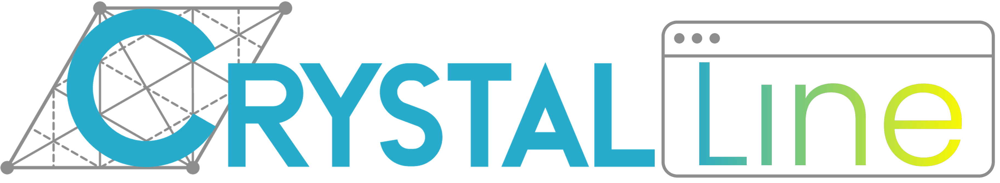
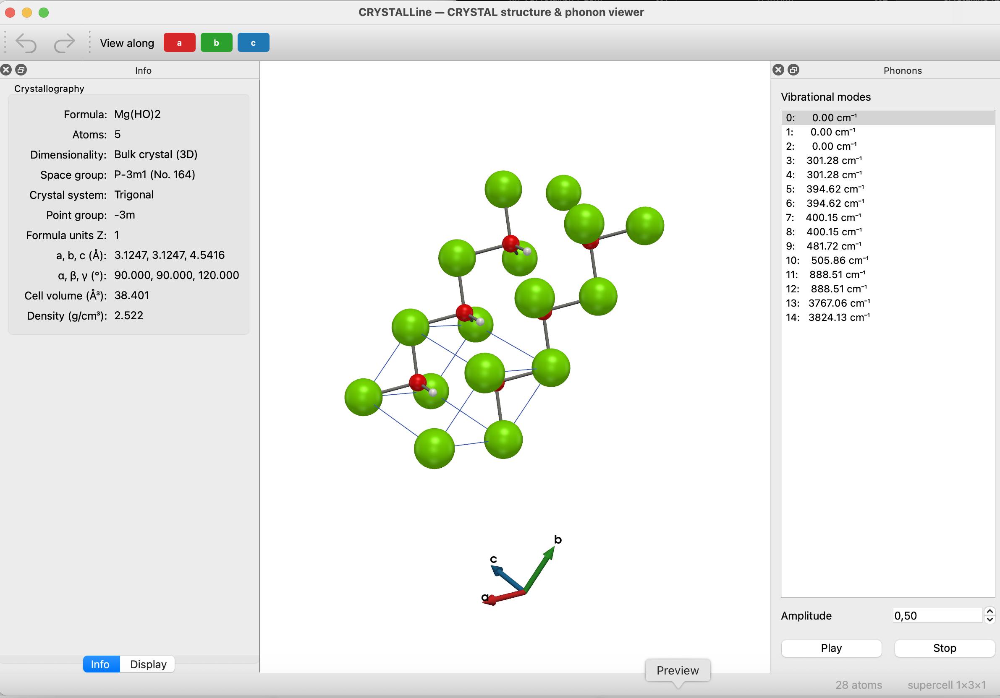
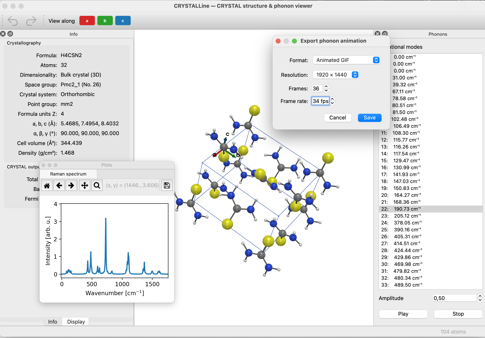
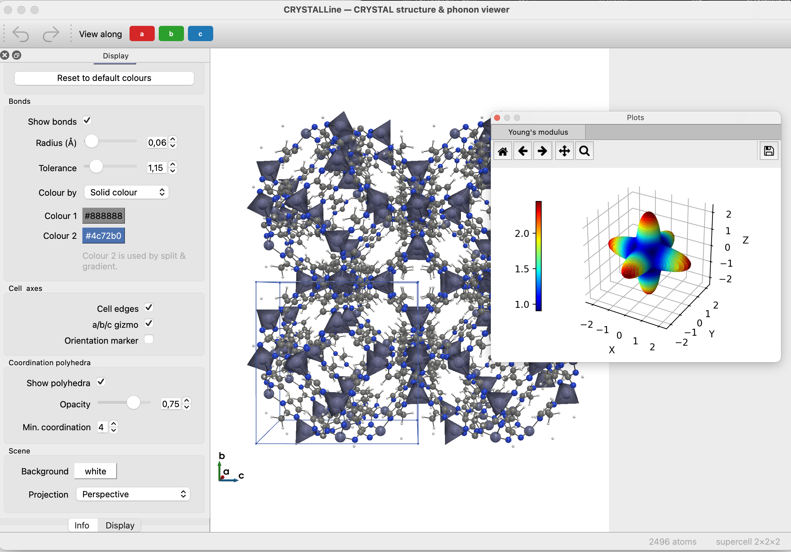
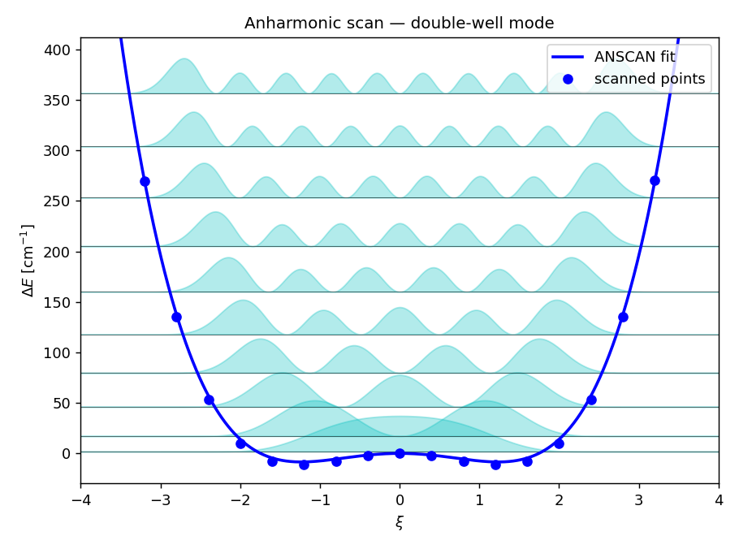
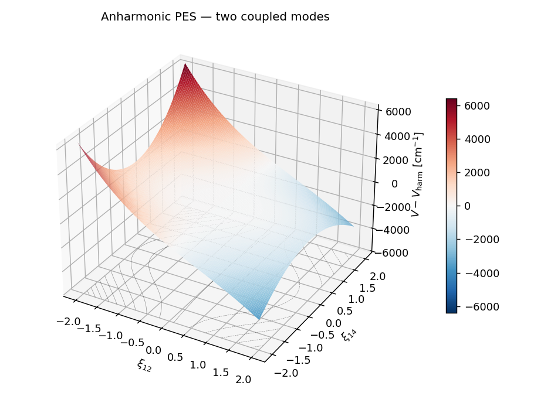

<p align="center">
  
</p>

<p align="center">
  A desktop app for building, editing and visualising <b>CRYSTAL</b> structures
  and their <b>phonon modes</b> — built on
  <a href="https://github.com/crystaldevs/CRYSTALClear">CRYSTALClear</a>.
</p>

<p align="center">
  
  
  
  
  
</p>

## Table of Contents 📑

- [Features](#features)
- [Installation](#installation)
- [Screenshots](#screenshots)
- [License](#license)
- [Acknowledgements](#acknowledgements)
- [Contact](#contact)

## Features 

**Structure viewer**
- Interactive 3D view (PyVista/VTK): ball-and-stick atoms, bonds, hydrogen
  bonds (dashed D–H···A interactions), optional coordination polyhedra
  (VESTA-style), the unit-cell wireframe and an a/b/c gizmo.
- One-click view alignment down the **a**, **b** or **c** axis.
- A rich, dockable **Display** panel: atom size/opacity, per-element colours,
  bond radius/tolerance, hydrogen bonds, cell, axes, polyhedra, measurement
  colours, background colour, projection, an orientation marker and element labels.
- Crystallographic **Info** panel, dimensionality-aware: space group(3D) or
  layer group(2D slabs), point group, lattice parameters, cell volume/area,
  density and formula — recomputed live as you edit.
- The same panel summarises the CRYSTAL run itself: code version, task,
  Hamiltonian and exchange/correlation functional (with the exact-exchange
  fraction and dispersion correction), k-point mesh, basis-set size, SCF
  thresholds, and the computed total energy, band gap and Fermi energy.

**Geometry & measurements**
- Measure a selection: distance (2 atoms), angle (3), dihedral (4) or
  a least-squares plane (3+); mark single-atom points.
- Overlay measurements in 3D and colour them per item or by type default.

**Phonons**
- Loads vibrational modes automatically when the CRYSTAL output has them.
- Filter the mode list to the IR- and/or Raman-active modes when the output
  reports the selection rules.
- Animate any mode in place — bonds, polyhedra and hydrogen bonds follow the
  motion; the amplitude is the peak displacement of the most-displaced atom,
  so one setting works for a molecule and for a large cell alike, and playback
  speed is adjustable. Export the animation as GIF or a numbered frame sequence
  with no extra packages, or as MP4 / MOV / WebM with
  `pip install imageio-ffmpeg` (also `pip install CRYSTALLine[video]`) —
  configurable resolution, frame count and frame rate.
- Modes away from Γ: a `DISPERSI` run's q-points appear in a selector, and
  each one animates as the travelling wave it is — every drawn cell carries its
  own phase, through the conventional cell, supercell tiling and boundary
  completion alike. One click tiles the cell to a whole period of the wave.
- For a still image of such a mode, the displacement arrows can be scaled by
  how far each atom moves and coloured by the phase of the cell it sits in —
  cycling once per wavelength, which is what a snapshot of a travelling wave
  has to show, its amplitude being identical in every cell.

**Editing**
- Select atoms (click / Ctrl-click), drag them in 3D (periodic images move
  together), drag a whole selection as one piece, or nudge with the arrow keys.
- Add, delete, duplicate, translate and re-element atoms — with a
  visual periodic-table, element picker — and full undo / redo.
- Cell tools: conventional cell, supercells, boundary completion and editable
  lattice parameters.

**Import / export**
- Open CRYSTAL `.out` / `.gui` / `.f34` files and `.cif` structures.
- Import atoms from `.xyz` / `.pdb` / `.cif` into the current structure.
- Save the structure as `.gui` or `.cif` (symmetry-reduced).
- Export the 3D view as an image (PNG/JPEG/TIFF/SVG/PDF/EPS) with resolution and
  transparency options.

**Input builder**
- Write a ready-to-run CRYSTAL input deck for the current structure, with a live
  preview of the exact input before you save it.
- Geometry is derived from the structure — space group and asymmetric unit for a
  crystal, and the right coordinate convention for slabs, polymers and molecules.
- Choose the method (HF or DFT, one functional keyword or separate exchange and
  correlation), basis set, SCF settings and the calculation: single point,
  geometry optimisation, frequencies with IR/Raman, phonon dispersion, QHA,
  equation of state, elastic constants, CPHF, anharmonic runs and spin–orbit
  coupling.

**Property plots** (via CRYSTALClear, shown in a dockable tabbed panel)
- IR and Raman harmonic and anharmonic (VSCF, VCI) spectra
- Anharmonic PES (1D, 2D)
- VCI states representation (heatmap, Sankey plot)
- Double-well potential energies, wavefunctions and probability densities
- Elastic properties (Young's modulus, linear compressibility,
  shear modulus, Poisson ratio)
- Equation of state
- Electronic and phonon band structures and densities of states,
- Simulated XRD

## Installation

Public releases of the code are distributed through Pypi.

### Requirements

The following will be installed if not already present:

- PySide6 < 6.10 >=6.5
- pyvista >= 0.43
- pyvistaqt >= 0.11
- numpy >= 1.23
- ase >= 3.23
- pymatgen >= 2023.11.10
- CRYSTALClear >= 0.2.16

### Steps

1. Create a conda environment (suggested)
   ```sh
   conda create --name crystal python=3.12
   ```
2. Activate the environment (suggested)
   ```sh
   conda activate crystal
   ```
3. Install
   ```sh
   pip install CRYSTALLine
   ```

## Usage

```sh
crystalline
```

Use **File → Open** to load a CRYSTAL `.out`/`.gui`/`.34` file or a `.cif`. If a
CRYSTAL output contains a vibrational calculation, the phonon modes are loaded
too — pick one in the **Phonons** panel and press **Play**. If the run sampled
more than Γ (`DISPERSI`), choose the q-point above the mode list and press
**Tile** to repeat the cell over one period of that wave — the same button turns
into **Untile** and puts the cell back. Otherwise the
geometry is shown on its own. Tweak the look from the **Display** panel, measure
geometry from the **Geometry** panel, and build property plots from the **Plot**
menu.

Enable **Edit → Editing mode** (`Ctrl+E`) to edit atoms: click to select, drag or
**arrow-key** the selection to move it, `Del` to delete, and pick elements from
the visual periodic table.

CRYSTALLine runs on **Linux, macOS and Windows** — anywhere PySide6 and a working
OpenGL/VTK stack are available.

### Linux: Wayland sessions

VTK draws into an X11 window, so on a Wayland session CRYSTALLine asks Qt for
the X11 (`xcb`) plugin automatically and runs through XWayland. If you have
forced `QT_QPA_PLATFORM=wayland` yourself, startup fails with
`BadWindow (invalid Window parameter)` — unset it, or run:

```sh
QT_QPA_PLATFORM=xcb crystalline
```

On Ubuntu 24.04 the `xcb` plugin also needs system libraries that aren't pulled
in by pip:

```sh
sudo apt install libxcb-cursor0 libxcb-icccm4 libxcb-image0 libxcb-keysyms1 libxcb-randr0 libxcb-render-util0 libxcb-shape0 libxcb-xinerama0 libxcb-xkb1 libxkbcommon-x11-0
```

## Screenshots

<p align="center">
  
</p>

<p align="center">
  <b>Everything in one window.</b><br>
  Crystallography, the interactive 3D view and every vibrational mode —
  recomputed live as you edit.<br>
  <sub>Brucite, Mg(OH)₂ · P-3m1 · 1×3×1 supercell</sub>
</p>

<br>

<table>
  <tr>
    <td width="50%"></td>
    <td width="50%"></td>
  </tr>
  <tr>
    <td align="center" valign="top">
      <b>🎬 Spectra, and modes as movies</b><br>
      <sub>A computed Raman spectrum beside the structure. Click a peak to
      select the mode behind it, animate it, and export the result as a GIF
      or a video.<br><br>Thiourea · Pmc2₁ · 104 atoms</sub>
    </td>
    <td align="center" valign="top">
      <b>🔷 Polyhedra and elastic surfaces</b><br>
      <sub>VESTA-style coordination polyhedra on a 2×2×2 supercell, drawn as a
      single mesh so thousands of atoms stay interactive, with a Young's-modulus
      surface from the elastic tensor.<br><br>2496 atoms</sub>
    </td>
  </tr>
  <tr>
    <td width="50%"></td>
    <td width="50%"></td>
  </tr>
  <tr>
    <td align="center" valign="top">
      <b>〰️ Anharmonic scans</b><br>
      <sub>The scanned potential, the vibrational states it supports and the
      probability density of each — here the double well of an imaginary mode,
      whose two lowest states are split by tunnelling.<br><br>Pbnm perovskite · ANSCAN</sub>
    </td>
    <td align="center" valign="top">
      <b>🏔️ Anharmonic PES</b><br>
      <sub>How two normal modes couple through their cubic and quartic terms,
      as a 3D surface or a contour map, with the harmonic bowl taken out so the
      coupling is what you see.<br><br>CH₄ · modes 12 × 14 · ANHAPES</sub>
    </td>
  </tr>
</table>

## Architecture

The package is deliberately layered so the domain logic stays independent of the
Qt UI — and therefore unit-testable without a display:

```
src/crystalline/
├── core/        domain model — Structure, phonons, cells, bonds, undo (no Qt)
├── crystalio/   thin adapter over CRYSTALClear (load/save, property plots)
├── viz/         PyVista/VTK rendering, phonon animation, image/movie export (no Qt)
├── ui/          PySide6 widgets: 3D viewport, dockable panels, main window
└── resources/   bundled assets (logo)
```

Only `ui/` (and the viewport that embeds the VTK interactor) imports Qt. Adding a
new property (a new plot, panel, …) is a matter of dropping a widget into
`ui/panels/` and wiring its signals in `MainWindow`.

## License

[GNU General Public License v3.0 or later](LICENSE).

## Acknowledgements

Built on the [CRYSTALClear](https://github.com/crystaldevs/CRYSTALClear) I/O and
plotting framework for the [CRYSTAL](https://www.crystal.unito.it/) quantum
chemistry code.

This software was developed with the assistance of
[Claude](https://www.anthropic.com/claude) (Anthropic), using
[Claude Code](https://www.claude.com/product/claude-code).

## Contact

- Website: https://www.crystal.unito.it
- Email: crystalunito@gmail.com
- Instagram: [@crystaldevs](https://www.instagram.com/crystaldevs/)
